# Arthur Belo - 01615335

# Prism Studios

# Jogos em Java e Processing

Este repositório contém 5 jogos desenvolvidos em Java e Processing. Cada jogo tem uma implementação única e é uma demonstração de habilidades de programação com essas duas ferramentas.

## Jogos:

### 1. **java-marciano-game** (feito em Java)
Um jogo simples de ação onde o jogador deve encontrar o marciano ou a Terra ira explodir.

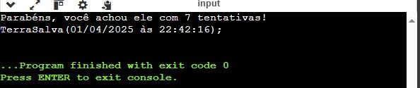

### 2. **java-velha-game** (feito em Processing)
Um clássico jogo da velha onde dois jogadores podem competir em uma partida. Foi desenvolvido com a linguagem de programação Processing e possui uma interface gráfica simples e fácil de usar.

### 3. **java-forca-game** (feito em Processing)
Um jogo de forca onde o jogador tenta adivinhar uma palavra, errando letras até perder o jogo. A interface gráfica foi feita usando o Processing.

### 4. **java-pong-game** (feito em Processing)
A versão clássica do Pong, onde dois jogadores competem para rebater a bola e marcar pontos. Foi desenvolvido no Processing, com controles simples e jogabilidade fluida.

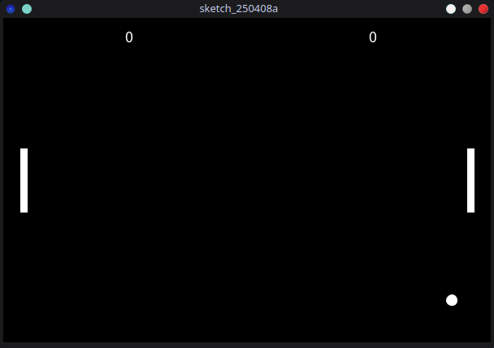
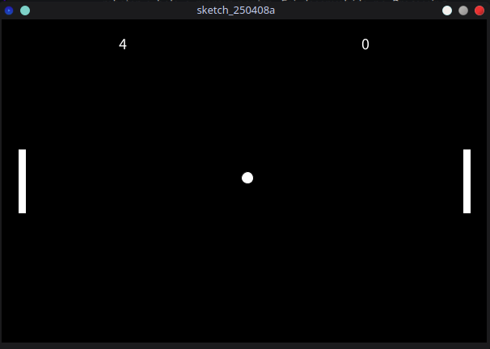
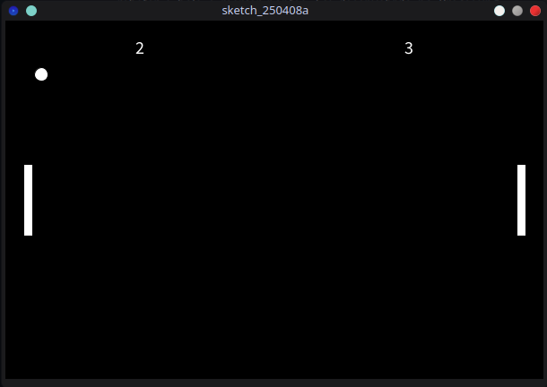
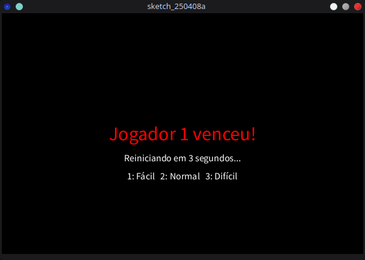
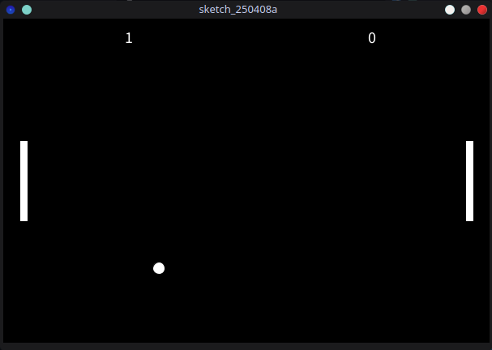

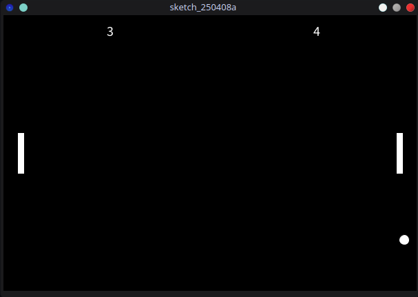

### 5. **java-memoria-game** (feito em Processing)
O jogo da memória usando imagens de frutas e animais, onde o objetivo é virar as cartas e encontrar os pares. O jogo foi implementado no Processing e inclui animações e lógica de embaralhamento de cartas.

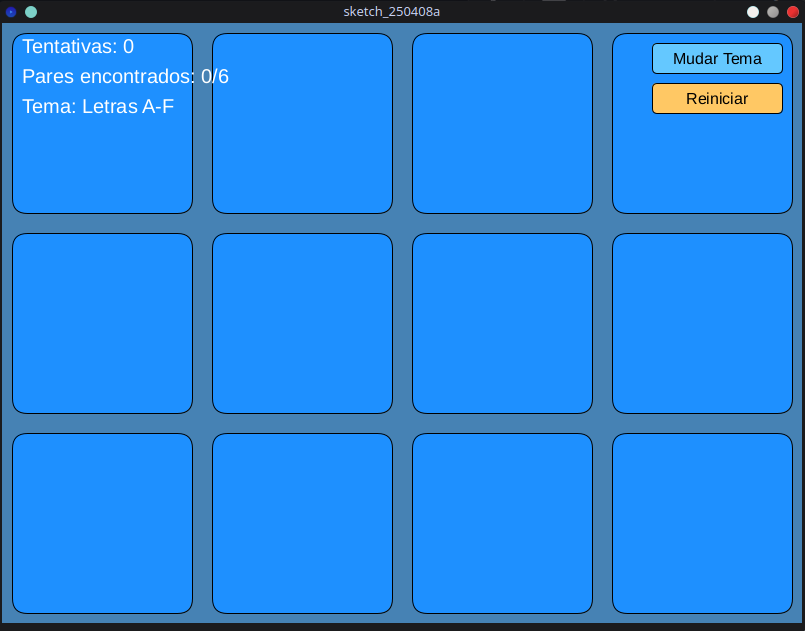
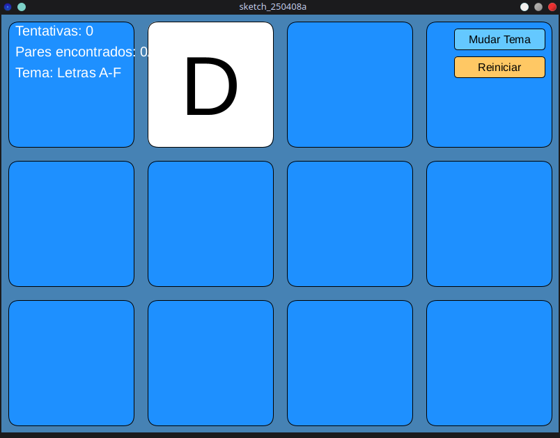
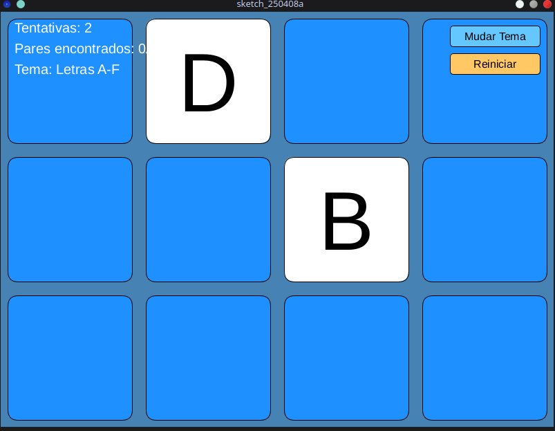
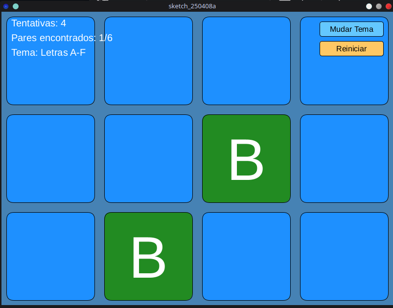
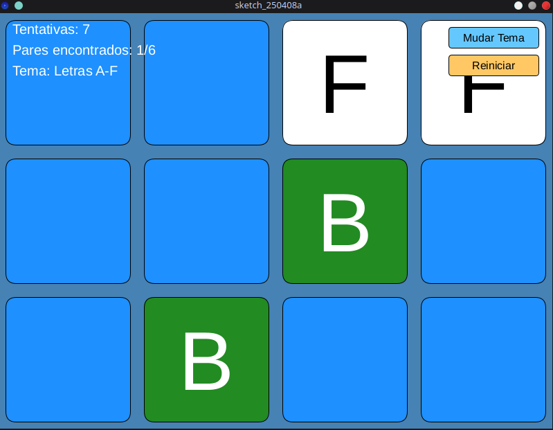
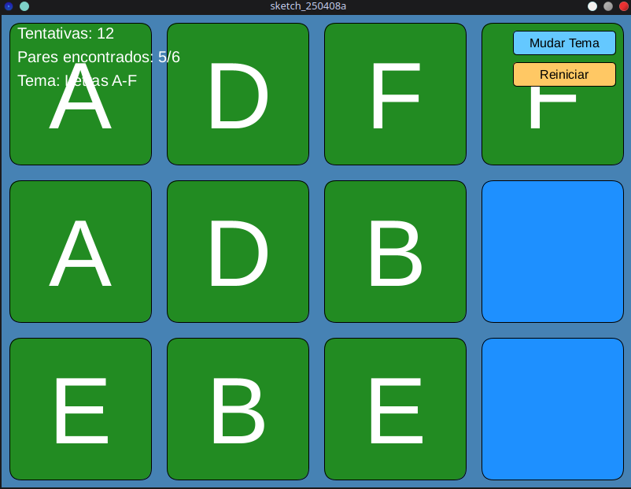
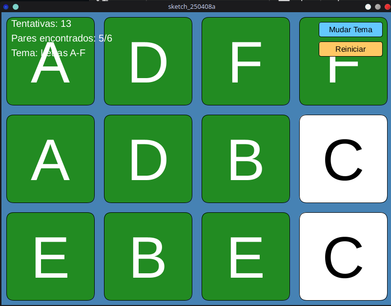
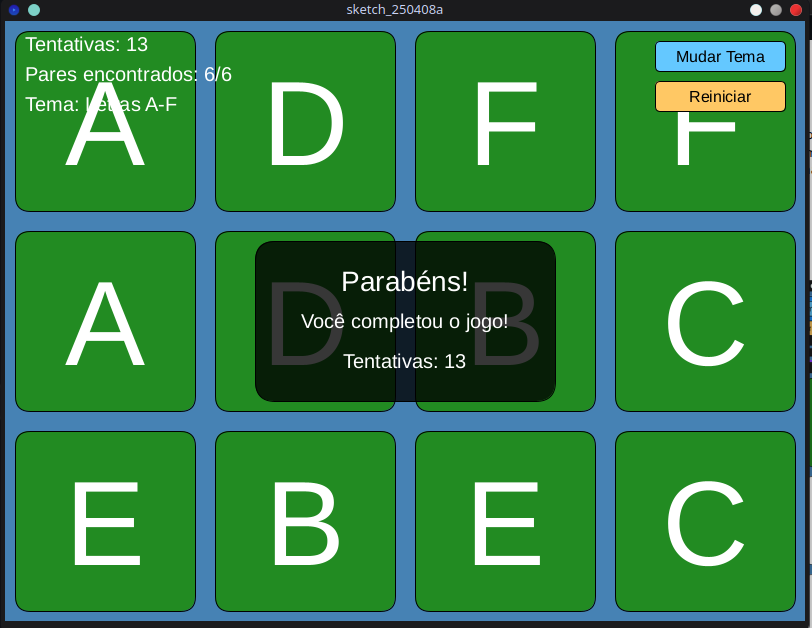
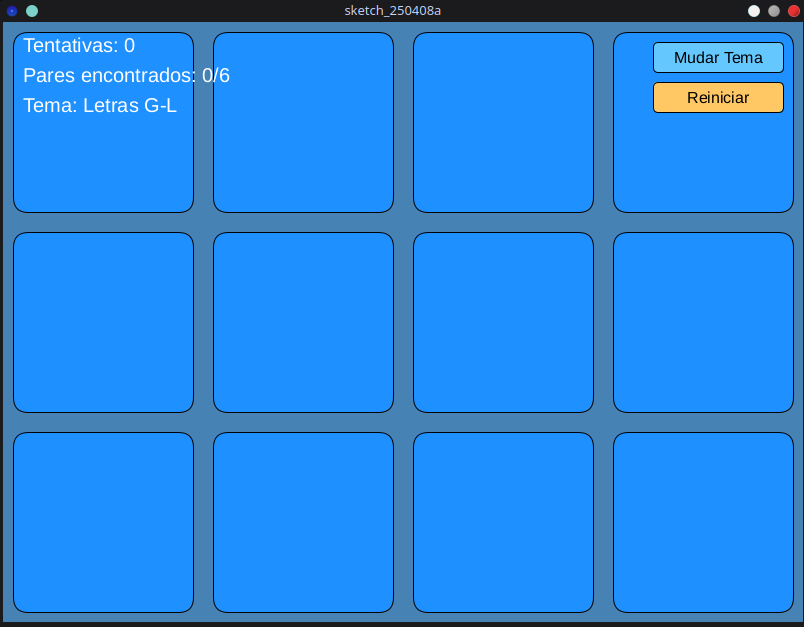

## Como Executar:

### Para o jogo **java-marciano-game** (Java):
1. Baixe e instale o JDK.
2. Abra o código em um editor de texto ou IDE (ex: IntelliJ IDEA, Eclipse).
3. Compile e execute o arquivo `Main.java` para iniciar o jogo.

### Para os jogos **java-velha-game**, **java-forca-game**, **java-pong-game**, **java-memoria-game** (Processing):
1. Baixe e instale o [Processing IDE](https://processing.org/download/).
2. Abra o código na IDE do Processing.
3. Clique em "Run" para executar o jogo.

## Tecnologias Usadas:
* **Java** para o jogo **marciano-game**.
* **Processing** para os outros jogos (velha, forca, pong, memória).

